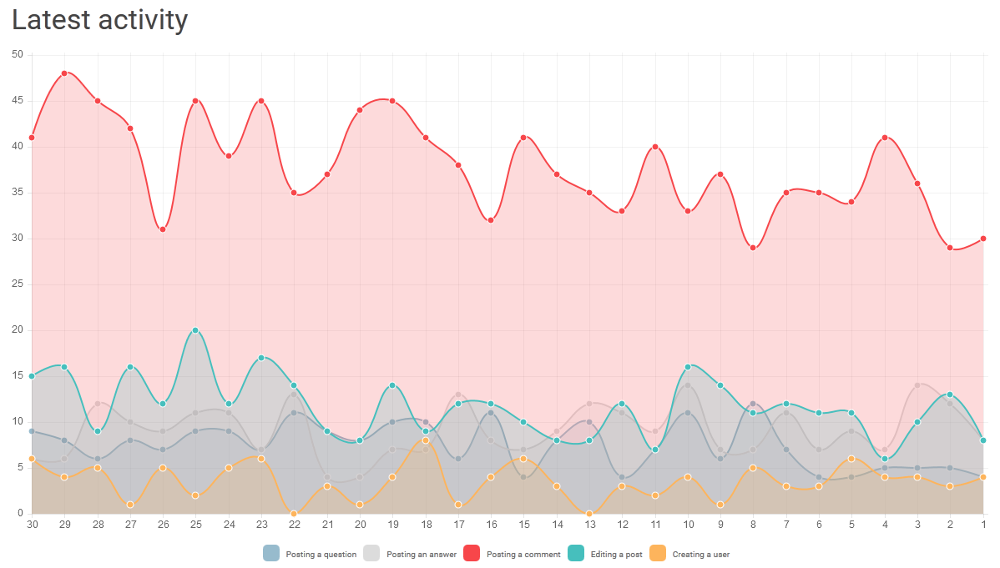
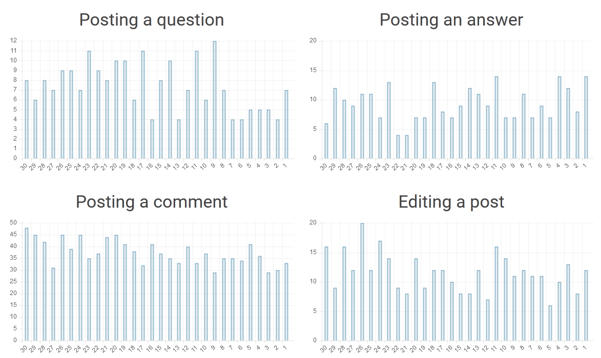
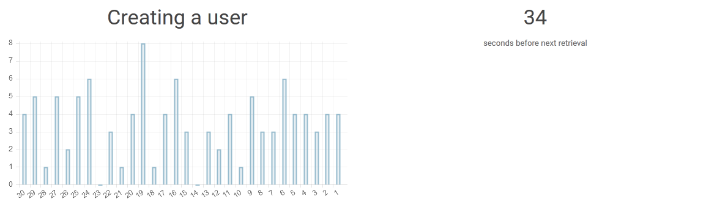
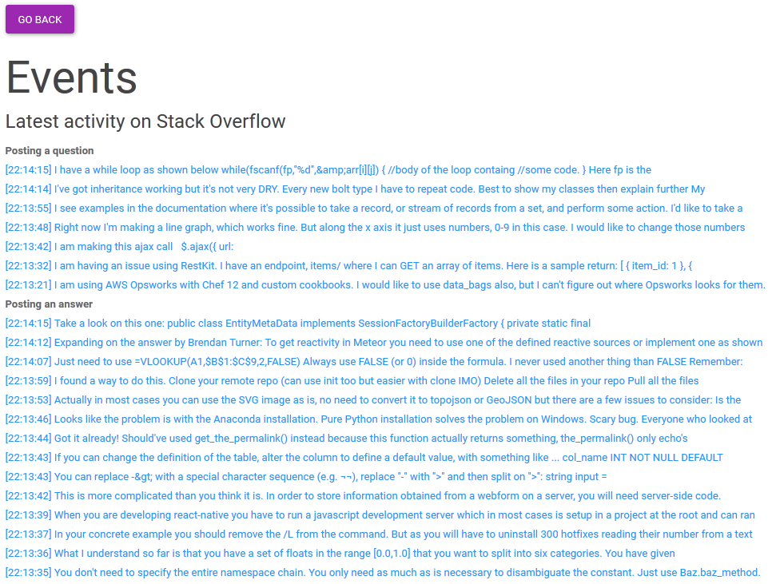
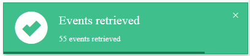

# TWEB TE2

Student: Julien Amacher

* Application: https://salty-mountain-1788.herokuapp.com
* Git repository: https://github.com/julienamacher/twebte2

## Technologies

* NodeJS + ExpressJS
* Bootstrap
* AngularJS
* ChartJS
* StackExchange API

## Before testing the app ...

**Important**: When choosing the website to monitor, please start with StackOverflow,
since it is the one that sees the most activity. Otherwise you might not see anything for a while.

You might need to login twice if you just authorized the application.

## Feature

The idea of this project is to display in near real time activity on any website under the StackExchange unbrella.

## StackExchange API

To implement the feature, these two API calls are used against StackExchange:
  * https://api.stackexchange.com/docs/events : Used to retrieve actual events
  * https://api.stackexchange.com/docs/sites : Used to retrieve all websites managed by StackExchange

In addition, since the /events requires authentication, the implicit OAuth authentication is used to retrieve an anthentication token (https://api.stackexchange.com/docs/authentication)

Considering we will make quite a lot of API calls against the /events endpoint, a `key` will be used. It allows us to have 10k requests per 24 hours (and per key).

## AngularJS

The Angular app will poll the /events endpoint once per minute and will display how many of these events happened, as well as their summaries:
- Someone posted a question
- Someone posted an answer
- Someone posted a comment
- Someone edited a post
- A new user was created

The first page, _home_, will:
  * Request the user to authenticate against StackExchange (you can use the following credentials: bufokaj@mailzi.ru vI1J7hBkeCFr). StackExchange will then pass an authentication token back to Angular
  * Will allow the user to edit the key and token that will be used to query events
  * Finally, will let you choose which website you want to monitor (for example, StackOverflow)

Then, the _events_ page is displayed.

Its role is to periodically poll the /events endpoint (will most probably request several HTTP requests since it is paginated) and:
  * graph the results
  * display an excerpt of each event, so you can have an idea of what is happening

When calling the /events endpoint, a `filter` that will add the optional `excerpt` and `link` to the returned events attributes is specified. Since we'll be using the same filter for each requests, it has been created manually using the HTTP forms provided by StackExchange.

You can see here https://api.stackexchange.com/docs/read-filter#filters=!9YdnSFEOX&filter=default&run=true that our filter (!9YdnSFEOX) is configured to display the "event.excerpt" and "event.link" attributes.

### Authentication token

Since we will be using at least one method that requires authentication, we will need to obtain a `token` that we will pass to our requests. This token is obtained once authenticated against StackExchange. To do so, we first have to register a StackApp application :

* Go to http://stackapps.com/apps/oauth/register
* Authenticate using any account
* Specify an application name, a description, the OAuth domain as well as the application domain
* You will then be granted:
  * a Client ID: used in the OAuth flow
  * a Client Secret : only used in the OAuth explicit process (whichis not used in this project)
  * a Key, which allows for more quota when querying StackExchange API endpoints (10k/day)

API key is already present in the Angular `home` controller. The `token` is retrieved from the OAuth process.

### Retrieving events

The /events endpoints accepts the following parameters:

https://api.stackexchange.com/2.2/events?key=CUSTOM_KEY&site=WEBSITE&page=PAGE&pagesize=ITEMS_PER_PAGE&since=SINCE_UNIX_TIMESTAMP&access_token=AUTHENTICATION_TOKEN_FROM_OAUTH&filter=CUSTOM_FILTER

Custom parameters:
  * CUSTOM_KEY : key that will allow us to have a larger quota when querying the API
  * WEBSITE : api name of the website under the StackExchange unbrella to monitor. For example: stackexchange
  * PAGE ; page to retrieve (starts from 1), necessary because the data is paginated
  * ITEMS_PER_PAGE : quantity of items to return. Maximum is 100 and that's what is used in the application
  * SINCE_UNIX_TIMESTAMP : allows us to define from which point in time we want the events to be shown (a unix timestamp)
  * AUTHENTICATION_TOKEN_FROM_OAUTH : this is the authentication token obtained from the OAuth authentication process
  * CUSTOM_FILTER : name of a custom or standard filter. Filters allow us to define which fields are returned when doing an API call. For this project, the one used has been created using their Web interface.

A typical response follows:

```json
{
   "items":[
      {
         "creation_date":1452200233,
         "event_id":34620176,
         "event_type":"post_edited",
         "excerpt":"Hope this help you: \n\nSub parsingText()\nDim a 'to store the parsed text\nDim t\nDim myAscii As Integer\n\na = Split(Range(\"A1\"), \".\")\n\nFor t = 1 To ",
         "link":"http://stackoverflow.com/questions/34618684/excel-vba-script-to-add-multiple-rows-in-cells-after-number-dot-char/34620176#34620176"
      },
      {
         "creation_date":1452200232,
         "event_id":57075674,
         "event_type":"comment_posted",
         "excerpt":"@Jae, I cannot find python and strftime in my ksh.                                                            $ YEST=$(echo $(date +%s) - 60*60*24 | b",
         "link":"http://stackoverflow.com/questions/34644281/how-to-change-month-in-shell-script/34649644#comment57075674_34649644"
      },
      {
         "creation_date":1452200232,
         "event_id":57075673,
         "event_type":"comment_posted",
         "excerpt":"Is this question missing an AJAX, jquery or other library tag?",
         "link":"http://stackoverflow.com/questions/34664796/cannot-read-property-bind-of-undefined-when-binding-2-functions#comment57075673_34664796"
      },
      {
         "creation_date":1452200230,
         "event_id":5759689,
         "event_type":"user_created",
         "excerpt":"Alexei Ferreira",
         "link":"http://stackoverflow.com/users/5759689/alexei-ferreira"
      }
      {
         "creation_date":1452200224,
         "event_id":34665009,
         "event_type":"answer_posted",
         "excerpt":"You can a non-capturing group for the prefixes:\n\n/(?:^|\\s)(american tea)/ig\n\n\nhttps://regex101.com/r/qB0uO2/1\n",
         "link":"http://stackoverflow.com/questions/34664662/regex-matching-for-set-of-words/34665009#34665009"
      }
   ],
   "has_more":true,
   "quota_max":10000,
   "quota_remaining":9771
}
```

If the `has_more attribute` is true, then more API calls should be done to gather all the events created from the specified point in time.
We can also see our current quota (we already did 10000-9771=229 requests in the last 24 hours)

Events must be retrieved periodially from StackExchange, otherwise they are lost : there is no history and no mean to query for events that are older than 15 minutes.

The application will count the quantity of each event type (user_created, answer_posted, ...) and display how many of them were seen during the group API call used to retrieve events during the previous 60 seconds.

## Graphing

This data is then used to produce multiple graphs. As configured, only the data gathered during the last 30 minutes is displayed.

Here is the main graph:



Here is the same data, in barchart form:



The remaining time before the next retrieval is visible:



In addition, the excerpt and link attributes are used to display a list of the latest entries retrieved from the API.



There is a problem regarding the redirection StackExchange does once the user returns to our app.
Indeed, StackExchange breaks our url by adding one too many `#` :

https://salty-mountain-1788.herokuapp.com/#/events#access_token=rStfA925LIT3YMw1En%28pEA%29%29&expires=86399

As a workaround, the url is parsed manually to extract the `access token`

## Notifications

A <a href="http://lobianijs.com/site/lobibox">Lobibox</a> notification will display how many notifications have been retrieved:




